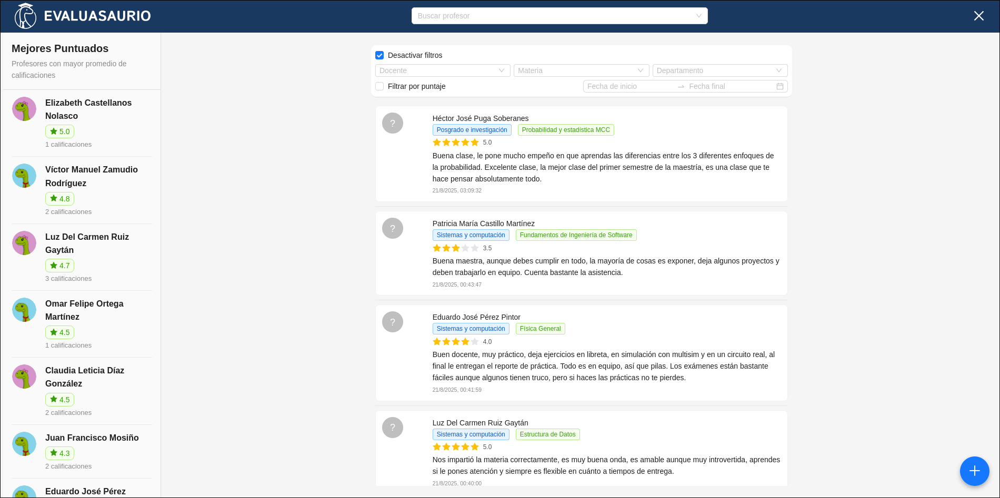
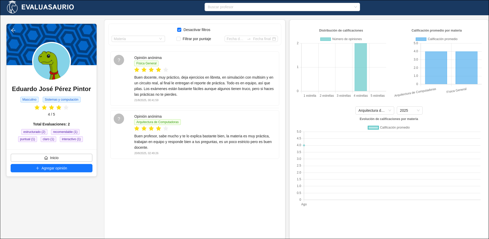

# Evaluasaurio - Plataforma de Evaluación de Profesores
**Evaluasaurio** es una aplicación web desarrollada en **React** con un **backend en Slim PHP**, diseñada para que las y los estudiantes evalúen a sus profesores de manera **anónima**, ofreciendo retroalimentación sobre el desempeño docente por materia.


## Contexto y motivación

En el **Tecnológico Nacional de México, campus León**, no existe un sistema de evaluaciones **plenamente anónimas**. Esta limitación abre la posibilidad de **represalias** hacia el alumnado y compromete la **objetividad** de las valoraciones.  
Además, cuando el estudiantado de **nuevo ingreso** registra sus materias, carece de información confiable sobre el desempeño de los profesores, lo cual dificulta la toma de decisiones informadas.  
**Evaluasaurio** surge para atender estas problemáticas:

- Garantiza **anonimato** en la evaluación para reducir sesgos y riesgos de represalias.  
- Provee un **historial de calificaciones y opiniones** por materia y por docente.  
- Permite que estudiantes **nuevos** obtengan una **idea clara** del estilo de enseñanza y la calidad percibida antes de **inscribirse** o **cambiar de grupo**.

## Sobre Singularity

**Singularity** es un colectivo interdisciplinario e independiente, sin afiliación institucional ni gubernamental, dedicado al desarrollo de soluciones tecnológicas, científicas y sociales de **código abierto** con impacto comunitario.  

Bajo el lema *“Ciencia abierta, tecnología social”*, la comunidad promueve la innovación colaborativa, el aprendizaje autodidacta y la transferencia tecnológica libre. Su estructura es descentralizada y se organiza en nodos regionales, lo que permite atender problemáticas locales mediante proyectos de impacto social.  

### Principios rectores
- Ciencia y tecnología abierta  
- Compromiso comunitario  
- Educación accesible  
- Colaboración interdisciplinaria  
- Impacto social sin fines de lucro  

Actualmente, Singularity tiene su base en **León, Guanajuato**, con miras a expandirse a otras regiones a través de nodos autónomos. Si te interesa más información, accede a [@Singularity-MX](https://github.com/Singularity-MX/) en GitHub.

## Descripción breve

Evaluasaurio permite calificar y opinar sobre docentes por materia de forma anónima, generando estadísticas y perfiles docentes que apoyan la mejora continua y decisiones de inscripción más informadas.

## Características principales

- Evaluación **anónima** de profesores por materia.  
- Visualización de **promedios**, **tendencias** y **opiniones**.  
- **Ranking** de docentes mejor evaluados.  
- Gestión de **solicitudes** de alta de profesores y materias.  
- API REST JSON para integración con frontends y servicios.


## Tecnologías

- **Frontend:** React, React Router, Vite.  
- **Backend:** PHP 8.x, Slim Framework 4, PDO.  
- **Base de datos:** MySQL/MariaDB.  
- **Infraestructura:** Variables de entorno con Dotenv, CORS habilitado.

## Instalación rápida

### Backend

1. Clonar el repositorio del backend:

Puedes encontrarlo aquí [Backend](https://github.com/ReplacedSpace17/Evaluasaurio_backend.git)


```bash
git  clone  https://github.com/ReplacedSpace17/Evaluasaurio_backend.git
```

2. Instalar dependencias con Composer:

```bash
cd  Evaluasaurio_backend
composer  install
```

3. Crear un archivo `.env` en la raiz del proyecto con la configuración de tu base de datos:

```
DB_HOST=localhost
DB_NAME=evaluasauriodb
DB_USER=usuario
DB_PASS=contraseña
DB_CHARSET=utf8mb4
```

4. Inicializar la base de datos con los archivos SQL incluidos (`database_init.sql`).

5. Ejecutar el servidor PHP (para desarrollo):

```bash
php  -S  0.0.0.0:8080  -t  public
```

### Frontend

1. Clonar el repositorio del frontend.

2. Instalar dependencias:

```bash
npm  install
```

3. Configurar la URL del backend en tus llamadas a la API (por ejemplo, `https://localhost:8080`).

4. Construir para producción:

```bash
npm  run  build
```

5. Subir la carpeta `dist/` al hosting de tu elección (por ejemplo, Hostinger).

## Uso

- Los estudiantes pueden navegar por la aplicación, seleccionar a su profesor y dejar una calificación y opinión anónima.

- Los administradores pueden revisar solicitudes de docentes y materias.

- La aplicación muestra estadísticas agregadas y rankings de docentes mejor evaluados.

## Capturas de pantalla





## Licencia

Este proyecto fue desarrollado por [@Replacedspace17](https://github.com/ReplacedSpace17), [@cessdel](https://github.com/cessdel) parte de [@Singularity-MX](https://github.com/Singularity-MX/) y [@CryZRz](https://github.com/CryZRz). Se distribuye bajo la **Licencia GPL**, permitiendo la libre distribución y modificación del software respetando los términos de la licencia.

## Contacto
Para dudas, sugerencias o contribuciones, contacta a [@Replacedspace17](https://github.com/ReplacedSpace17)  o [@cessdel](https://github.com/cessdel) parte del colectivo [@Singularity-MX](https://github.com/Singularity-MX/) en GitHub.

⠀⠀⠀⠀⠀⠀⠀⠀⠀⠀⠀⠀⠀⠀⠀⠀⠀⠀⠀⠀⠀⠀⠀⠀⠀⣀⣀⡤⠤⠤⠤⠤⠤⠤⣄⣀⠀⠀⠀⠀⠀⠀⠀⠀⠀⠀⠀⠀⠀⠀⠀⠀⠀⠀⠀⠀⠀⠀⠀⠀⠀⠀⠀⠀⠀
⠀⠀⠀⠀⠀⠀⠀⠀⠀⠀⠀⠀⠀⠀⠀⠀⠀⠀⠀⠀⠀⣠⠤⠖⢉⠭⠀⠴⠘⠩⡢⠏⠘⡵⢒⠬⣍⠲⢤⡀⠀⠀⠀⠀⠀⠀⠀⠀⠀⠀⠀⠀⠀⠀⠀⠀⠀⠀⠀⠀⠀⠀⠀⠀⠀
⠀⠀⠀⠀⠀⠀⠀⠀⠀⠀⠀⠀⠀⠀⠀⠀⠀⠀⢀⡴⠊⣡⠔⠃⠀⠰⠀⠀⠀⠀⠈⠂⢀⠀⢋⠞⣬⢫⣦⣍⢢⡀⠀⠀⠀⠀⠀⠀⠀⠀⠀⠀⠀⠀⠀⠀⠀⠀⠀⠀⠀⠀⠀⠀⠀
⠀⠀⠀⠀⠀⠀⠀⠀⠀⠀⠀⠀⠀⠀⠀⠀⠀⣠⢫⣼⠿⠁⠀⠀⠀⠐⠀⠀⠰⠀⠢⠈⠀⠠⠀⢚⡥⢏⣿⣿⣷⡵⡄⠀⠀⠀⠀⠀⠀⠀⠀⠀⠀⠀⠀⠀⠀⠀⠀⠀⠀⠀⠀⠀⠀
⠀⠀⠀⠀⠀⠀⠀⠀⠀⠀⠀⠀⠀⠀⠀⠀⢰⢓⣽⡓⡅⠀⠀⠀⠄⠀⠀⠄⠀⠁⠀⠀⠌⢀⠀⡸⣜⣻⣿⣿⣿⣿⣼⡀⠀⠀⠀⢀⣀⣀⡀⠀⠀⠀⠀⠀⠀⠀⠀⠀⠀⠀⠀⠀⠀
⠀⢀⡤⣤⣄⣠⠤⣄⠀⠀⠀⠀⠀⠀⠀⢀⣧⣿⡷⠹⠂⠀⠂⠀⢀⠠⠈⠀⠌⠀⠁⢈⠀⠄⢀⡷⣸⣿⣿⣿⣿⣿⣧⠃⠀⡴⢋⢠⣤⣦⣬⣕⢤⠀⠀⠀⠀⠀⠀⠀⠀⠀⠀⠀⠀
⣔⣵⣿⣻⣯⣍⣉⠚⢕⢆⠀⠀⠀⠀⠀⢸⢾⣽⡷⡂⠀⠀⠄⠂⠀⡀⠄⠂⠀⠌⠀⡀⠀⢀⡾⣯⢿⣿⣿⣿⣿⣿⣿⠰⠸⠠⢠⣾⣿⣿⣷⣿⣷⣕⡀⠀⠀⠀⠀⠀⠀⠀⠀⠀⠀
⣼⣿⣿⠿⠿⢿⣿⣇⡛⡻⣧⠀⠀⠀⠀⢼⢸⡟⡧⣧⠀⠃⠀⡀⠄⠀⢀⠠⠘⠀⠠⠀⠀⡟⢧⣛⣿⣿⣿⣿⣿⣿⣧⠇⠀⡇⢻⣿⣿⣿⠟⠻⣿⣿⣇⡀⠀⠀⠀⠀⠀⠀⠀⠀⠀
⣿⣿⠁⣠⣤⠀⠙⢿⣿⡤⢘⣆⠀⠀⠀⢹⣼⣿⡽⠖⠁⠀⢤⠀⠀⡐⠀⢀⠐⠈⠀⢠⠖⠙⠣⠟⣻⢿⣿⣟⣿⡿⠃⠀⠀⠃⢼⣿⣧⠀⠀⠀⠸⣿⣣⠇⠀⠀⠀⠀⠀⠀⠀⠀⠀
⣿⣿⣆⣿⡟⠀⠀⠀⣿⡇⠰⢸⠀⠀⠀⡸⡻⡕⠉⠀⠀⡐⠀⠈⠁⠀⠀⢠⠀⡴⠀⡠⠀⢀⠤⡲⠟⣉⠻⣿⣟⠁⠀⠀⠀⡅⢺⣿⣿⠃⠀⠀⠀⠈⠁⠀⠀⠀⠀⠀⠀⠀⠀⠀⠀
⠈⠙⠛⠉⠀⠀⠀⣀⡿⣗⠧⣼⠀⠄⡎⣿⣇⣧⣀⠑⢆⠀⠀⠀⢹⢄⢀⢧⠊⢀⠊⠀⠘⡡⣪⡴⠛⢻⣷⣜⣿⣦⠀⠀⡀⡿⣸⣿⣿⡆⠀⠀⡠⢐⠫⠉⠩⠭⣗⣦⡀⠀⠀⠀⠀
⠀⠀⠀⠀⠀⠀⢠⢹⣷⣻⠇⣿⠘⡀⣿⣿⣿⣿⠛⠛⢦⣙⠄⠀⢈⣫⢼⠀⠤⠁⠀⣠⣾⣿⡇⠀⠐⠂⢻⣿⣟⣿⡇⢠⠃⣧⣿⣿⣾⠁⢀⢎⣴⡶⡿⢿⣟⣷⢮⡝⢿⣷⠤⡀⠀
⠀⠀⠀⠀⠀⠀⠈⣽⣯⢿⣣⡹⢰⠘⣿⡿⣹⣿⠀⠀⠹⣿⡿⣷⣬⣯⣾⣷⣤⣴⣾⡟⣍⡿⠃⠀⠀⠀⢸⣿⣿⣩⣒⣵⣷⣿⣿⡿⠃⠀⡞⢺⣿⣿⣯⢿⠉⠀⠉⠛⢦⣻⣇⠘⡆
⠀⠀⠀⠀⠀⠀⣀⣿⣾⡾⣿⣵⡢⠳⢿⣷⢹⣿⣆⠀⠀⠈⠉⢉⣽⢟⣿⠟⢻⢿⣷⣄⡁⠀⠀⠀⠀⣀⣾⡟⣍⣿⣿⣿⣿⣿⣿⡗⠀⠀⠇⣽⣿⣿⣿⡼⠀⠀⣠⡤⣀⠿⠏⣴⠇
⠀⠀⠀⠀⠀⠀⠸⡼⣿⣿⣽⣿⣿⣶⣬⣿⣯⢿⣷⣥⠶⣒⣶⣾⠏⠐⠙⠀⠈⠚⡌⢪⣿⣧⣖⠦⡭⠿⢛⣼⣿⣿⢿⣿⣿⡿⠝⠁⠀⠰⢀⣿⣿⣾⣿⡇⠀⠀⠻⢿⡝⠲⠛⠋⠀
⠀⠀⠀⠀⠀⠀⠀⠉⢿⣿⣿⣿⣿⣿⣿⡿⠻⢷⣮⣉⣭⣡⣟⡱⠀⠀⡀⢀⡞⢀⢠⡀⠹⣿⣿⣿⣿⣾⣿⣿⣿⣿⣿⣟⠋⠀⠀⠀⡠⡡⣹⣿⣿⣿⠿⠡⢀⣀⠀⠾⠁⠀⠀⠀⠀
⠀⠀⠀⠀⠀⠀⠀⠀⠈⠻⠽⢿⢿⣻⡿⠈⢀⣶⣿⣿⣿⣿⡽⠃⢀⡴⣰⣿⢤⣓⢿⣿⣄⠙⣻⣷⡟⣿⣿⣿⣽⡻⣿⠿⠧⡶⣒⢭⣺⣽⣿⠟⢍⢀⠀⡉⠑⢶⣯⡲⣄⠀⠀⠀⠀
⠀⠀⠀⠀⣀⣀⡀⠀⠀⠀⣟⣷⣞⡟⠉⣴⡿⣯⣷⣿⣿⡟⡡⢀⣜⣼⣿⣿⣎⢳⢿⢻⣿⡄⠑⠿⣿⣿⣿⣿⣿⣿⣿⣿⣿⡿⣟⣾⣿⣿⢃⣠⣤⢖⡾⢷⡲⣆⡳⣿⣮⢢⡄⠀⠀
⠀⠀⡔⣩⢦⣐⣈⣦⣄⡠⢗⣿⣾⢁⣼⢏⣿⣿⣿⣿⡟⠐⣠⢝⣾⣿⣿⣿⣯⡟⣷⣿⣻⣿⣄⢈⢆⠻⢿⣿⣿⣿⣿⣿⣷⣿⣿⣿⣿⡧⢨⣲⣷⣿⠋⣟⣶⣀⣳⡖⣿⣇⣃⠀⠀
⠀⣘⡸⣞⣿⣿⣿⣿⣿⣿⣿⡿⠁⣺⣣⣿⣿⣿⣿⠎⢀⢢⣾⣿⣿⣿⣿⣿⣿⣿⣿⣿⣷⣿⣿⣢⢀⠡⡘⢪⡯⡻⣿⣿⣿⣿⣿⣿⣻⣟⢧⣽⣿⣿⠀⠀⣎⣱⡏⣏⣿⣯⡽⠀⠀
⠀⣿⣧⣼⣿⡟⠛⠛⠿⢟⠟⣁⣼⣿⣿⠛⢉⡜⠁⡠⣠⣷⢿⣿⡿⣿⣿⣿⣿⠟⠉⠙⠛⢯⣽⣯⠷⣄⠑⠜⠑⡷⡜⢿⠿⠟⠛⠉⠀⢸⢺⣾⣿⣿⣷⣄⣀⠏⣱⣿⣿⣿⠀⠀⠀
⠀⢹⣿⣾⣿⣿⣤⡤⠔⢑⣡⣾⡿⡿⠁⡠⠋⠀⡀⢀⣿⡟⣿⣿⣿⡙⣿⣻⣿⡄⠀⠀⠀⠀⠉⠻⣿⣟⣧⡄⠀⠘⣟⢦⡱⣄⠀⠀⠀⢸⣼⣿⢿⣿⣿⣷⣤⣾⣿⣿⣿⠏⠀⠀⠀
⠀⠀⠹⢿⣿⠏⣰⣧⣾⣿⣿⠟⠋⠀⡰⠡⡡⠀⣠⣿⣿⣿⣿⣿⣿⣗⢸⣿⣿⣷⠀⠀⠀⠀⠀⠀⠱⡹⣟⣿⣦⡁⠈⠳⢕⢄⠑⠂⠐⢾⣿⣿⣿⣿⣿⠛⠿⠟⠛⠋⠀⠀⠀⠀⠀
⠀⠀⠀⠀⣯⣼⣿⣿⠋⠁⠀⠀⠀⠀⡇⠐⠀⢠⣿⣿⡝⣿⠃⠈⢻⡞⢸⣿⣿⡟⠀⠀⠀⠀⠀⠀⠀⠉⢻⣷⣾⣿⣦⡄⠀⠀⠈⠐⢺⣽⣿⣿⡎⣿⡇⠀⠀⠀⠀⠀⠀⠀⠀⠀⠀
⠀⠀⠀⠀⣿⣻⡟⠁⠀⠀⠀⠀⠀⢸⡇⠀⢀⣿⣿⣿⣿⠏⠀⠀⢸⠳⣜⣹⣿⣧⠀⠀⠀⠀⠀⠀⠀⠀⠀⠹⡿⢿⣿⣿⣷⣶⣶⣶⣿⣿⢟⣻⣿⢟⡝⠀⠀⠀⠀⠀⠀⠀⠀⠀⠀
⠀⠀⠀⠀⠸⣿⣿⡦⠀⠀⠀⠀⠀⠘⡇⠰⣼⡿⡿⣾⡏⠀⠀⠀⢸⠣⣹⣾⣿⡹⠀⡠⢄⣂⢤⠀⠀⠀⠀⠀⠈⠉⠻⣟⢿⣾⣚⣿⣿⣿⣿⣽⡏⠊⠀⠀⠀⠀⠀⠀⠀⠀⠀⠀⠀
⠀⠀⠀⢠⣾⢛⣿⡟⠀⠀⠀⠀⠀⠀⢷⣀⢻⣷⣟⣻⡇⠀⠀⢀⢯⣅⣿⣷⣿⠇⣜⣾⣿⣿⣿⣧⣀⠀⠀⠀⠀⠀⠀⠈⠉⠸⠿⣿⠏⠘⠔⠊⠁⠀⠀⠀⠀⠀⠀⠀⠀⠀⠀⠀⠀
⠀⠀⠀⠈⠛⠛⠋⠀⠀⠀⠀⠀⠀⠀⠈⢻⡯⢿⣿⡿⡴⣀⡠⣪⡷⣽⣿⣿⡿⢚⣿⣿⡟⠀⠙⣿⡿⠀⠀⠀⠀⠀⠀⠀⠀⠀⠀⠀⠀⠀⠀⠀⠀⠀⠀⠀⠀⠀⠀⠀⠀⠀⠀⠀⠀
⠀⠀⠀⠀⠀⠀⠀⠀⠀⠀⠀⠀⠀⠀⠀⠀⠉⢹⡈⠛⠿⠽⢞⢋⠜⠻⣿⣿⣿⣿⠿⠋⠀⠀⠀⠀⠀⠀⠀⠀⠀⠀⠀⠀⠀⠀⠀⠀⠀⠀⠀⠀⠀⠀⠀⠀⠀⠀⠀⠀⠀⠀⠀⠀⠀
⠀⠀⠀⠀⠀⠀⠀⠀⠀⠀⠀⠀⠀⠀⠀⠀⠀⠀⠉⠓⠒⠛⠚⠁⠀⠀⠀⠀⠀⠀⠀⠀⠀⠀⠀⠀⠀⠀⠀⠀⠀⠀⠀⠀⠀⠀⠀⠀⠀⠀⠀⠀⠀⠀⠀⠀⠀⠀⠀⠀⠀⠀⠀⠀⠀
